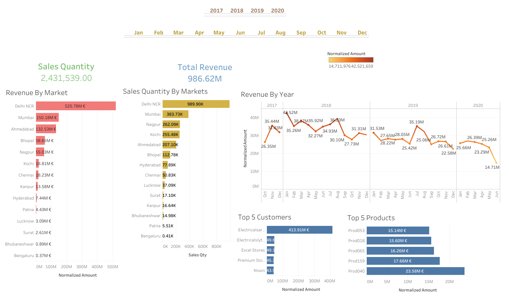

# Tech Sales Analysis

Sales analysis for a tech hardware company in India. The goal was to find out why revenue was dropping and where the business was too dependent on a few customers.

## The Problem

The company had 4 years of sales data but no clear picture of what was going wrong. Revenue was declining and leadership needed answers before making decisions.

**Questions I wanted to answer:**
- Which markets and customers bring in the most revenue?
- Is there too much dependency on a few big accounts?
- What does the sales trend look like?

## What I Found

| Metric | Value |
|--------|-------|
| Total Revenue | 986.62M Rs |
| Transactions | ~150,000 |
| Period | 2017-2020 |

**Main issues:**
- **Delhi NCR = 52% of revenue.** One market is half the business.
- **Top customer = 42% of sales.** Electricalsara Stores alone generates almost half. That's a huge risk.
- **Revenue dropped 18.8% in 2019** and kept falling in 2020.
- **South zone only 4.6%** despite having major tech cities like Bengaluru and Chennai.

## Dashboard



The dashboard shows revenue by market, monthly trends, and top customers. Built in Tableau with filters for year and month.

**[View interactive dashboard on Tableau Public](https://public.tableau.com/views/TechSalesAnalysis)** *(link to be added after publishing)*

## Tools & Architecture

- **SQL (MySQL)** - all data aggregations and business logic
- **Python** - visualizations only (no duplicate calculations)
- **Tableau** - interactive dashboard

The architecture is intentionally split: SQL handles all the number crunching, Python just plots the results. This avoids duplicating logic between the two and makes the code easier to maintain.

## Files

```
Tech Sales Analysis/
├── README.md
├── analysis.sql              # SQL queries - all aggregations happen here
├── eda.py                    # Python script - just visualizations
├── charts/                   # Generated charts (8 PNG files)
├── dashboard.png             # Dashboard screenshot
├── Tech_Sales_Analysis.twbx  # Tableau workbook
├── report.md                 # Full analysis report
├── market_analysis.csv       # Aggregated data export
├── customer_analysis.csv
└── yearly_analysis.csv
```

## How to Run

1. **SQL**: Run `analysis.sql` on any MySQL instance with the sales database. This has all the queries for data exploration and validation.

2. **Python**:
   ```bash
   # Set your MySQL password as environment variable
   export MYSQL_PASSWORD='your_password'

   # Run the script
   python eda.py
   ```
   The script connects to MySQL, runs the aggregation queries, and generates 8 charts in the `charts/` folder.

3. **Tableau**: Open `Tech_Sales_Analysis.twbx` in Tableau Desktop or Tableau Public.


